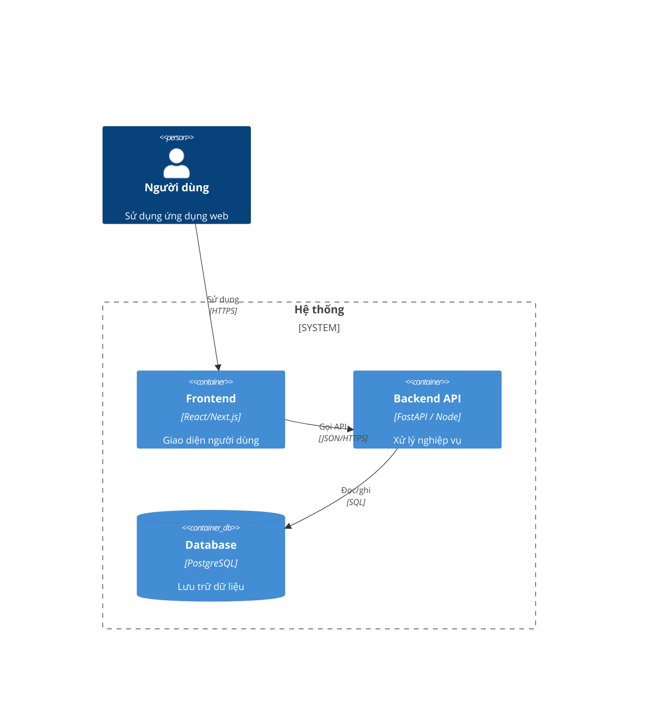
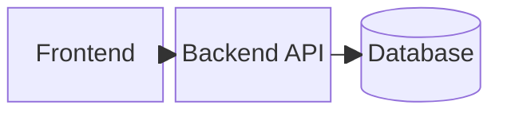

# Software Architecture Design (SAD) — Thiết kế kiến trúc

> Kiến trúc tổng thể: thành phần, ranh giới, luồng dữ liệu, công nghệ. ID: `ARC-###`.
> Mỗi thành phần **Traces** lên `SRS` mà nó hiện thực. _Components, boundaries, data flow._
>
> **Quy tắc biểu đồ (Đợt 3):** viết sơ đồ bằng **YAML** (`type: c4container` / `type: block`) — nguồn
> chân lý; Mermaid do `bash scripts/render-mermaid.sh` sinh ra (đừng sửa tay). Kiến trúc tổng quát
> **ưu tiên C4 model** + **Biểu đồ khối**. `check-completeness.sh` **chặn** nếu thiếu nguồn YAML/Mermaid.
> _Author diagrams as YAML (source); Mermaid is generated. C4 + block required._

## Kiến trúc tổng quát — C4 model (BẮT BUỘC)
> **Nguồn là YAML** (sửa ở đây); Mermaid do `bash scripts/render-mermaid.sh` sinh ra bên dưới — đừng sửa tay.
```yaml
type: c4container
title: C4 Container — <Tên hệ thống>
boundary: "Hệ thống"
persons:
  - {id: user, label: "Người dùng", desc: "Sử dụng ứng dụng web"}
containers:
  - {id: web, label: "Frontend", tech: "React/Next.js", desc: "Giao diện người dùng"}
  - {id: api, label: "Backend API", tech: "FastAPI / Node", desc: "Xử lý nghiệp vụ"}
  - {id: db, label: "Database", tech: "PostgreSQL", desc: "Lưu trữ dữ liệu", db: true}
rels:
  - {from: user, to: web, label: "Sử dụng", tech: "HTTPS"}
  - {from: web, to: api, label: "Gọi API", tech: "JSON/HTTPS"}
  - {from: api, to: db, label: "Đọc/ghi", tech: "SQL"}
```

<!-- MERMAID:START (sinh bởi render-mermaid.sh từ YAML trên — ĐỪNG sửa tay) -->

<!-- MERMAID:END -->

## Biểu đồ khối — Block diagram (BẮT BUỘC)
```yaml
type: block
title: Block — Kiến trúc khối
columns: 3
nodes:
  - {id: fe, label: "Frontend"}
  - {id: be, label: "Backend API"}
  - {id: db, label: "Database", shape: cyl}
edges:
  - {from: fe, to: be}
  - {from: be, to: db}
```

<!-- MERMAID:START (sinh bởi render-mermaid.sh từ YAML trên — ĐỪNG sửa tay) -->

<!-- MERMAID:END -->

## Thành phần — Components

| ID | Thành phần / Component | Trách nhiệm | Traces ↑ (SRS) |
|----|-------------------------|-------------|----------------|
| ARC-001 | Auth Service (`backend/services/auth`) | Xác thực mật khẩu, **2FA OTP qua email**, phát hành & kiểm JWT; connection pool + cache để đạt **p95 < 300ms (NFR-001)**. | SRS-001, SRS-002 |
| ARC-00x | _(thành phần tiếp theo...)_ | | SRS-00x |

## Threat model (STRIDE-lite) — Mô hình đe doạ (BẮT BUỘC)
> Với mỗi thành phần/luồng nhạy cảm, liệt kê đe doạ theo **STRIDE** + biện pháp. Làm **trước khi code**.
> _(S)poofing · (T)ampering · (R)epudiation · (I)nfo disclosure · (D)oS · (E)levation of privilege._

| Thành phần/luồng | Đe doạ (STRIDE) | Biện pháp giảm thiểu | Liên quan |
|------------------|-----------------|----------------------|-----------|
| Đăng nhập / OTP (ARC-001) | S: đoán mật khẩu/OTP; D: dội OTP | Rate-limit + khoá tạm (NFR-002); OTP hết hạn ngắn, một lần | SRS-002 · NFR-002 |
| JWT | T: sửa token; E: leo quyền | Ký & kiểm chữ ký; kiểm quyền ở backend | SRS-001 |
| _(luồng tiếp theo...)_ | | | |

## Quyết định kiến trúc — Decisions
> Quyết định lớn → ghi ADR trong [../adr/](../../docs/adr).

> Mỗi `ARC` phải được ≥1 `DD` chi tiết hóa ([03-DDD.md](../04-detailed-design/03-DDD.md)) **và**
> ≥1 `IT` (Integration Test — [../07-integration-test/test-cases.md](../07-integration-test/test-cases.md)) kiểm chứng.

## Checklist review chất lượng — Quality review
- [ ] Mỗi thành phần **truy về `SRS`** và đủ để hiện thực các `SRS` đó.
- [ ] **Ranh giới & trách nhiệm** rõ; phụ thuộc **một chiều**, không vòng.
- [ ] **Luồng dữ liệu** giữa các thành phần được mô tả.
- [ ] Đã cân nhắc **phi chức năng** (bám `NFR-###`): hiệu năng, bảo mật, mở rộng, lỗi/khôi phục.
      **Mọi `NFR` phải xuất hiện ở đâu đó trong SAD** (thành phần/quyết định/threat model) — `check-traceability` chặn nếu thiếu.
- [ ] Có **Threat model (STRIDE)** cho luồng nhạy cảm, kèm biện pháp giảm thiểu.
- [ ] Quyết định công nghệ lớn có **ADR** kèm lý do (xem `../adr/`).
- [ ] Khớp với cấu trúc thực tế trong [../STRUCTURE.md](../../docs/STRUCTURE.md).
