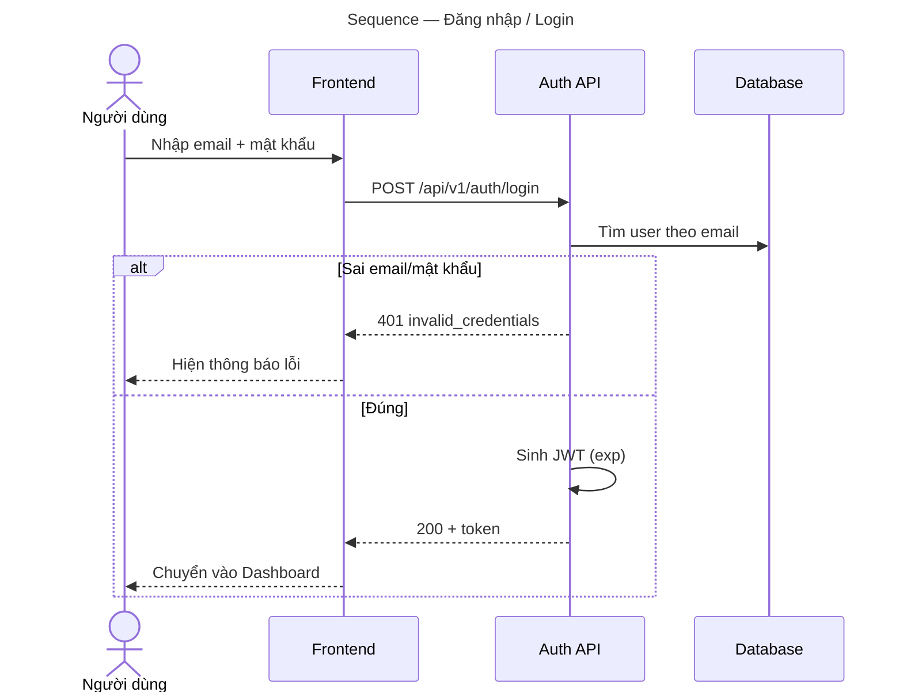

# Detailed Design (DDD) — Thiết kế chi tiết

> Thiết kế mức module/hàm. ID: `DD-###`, mỗi mục **Traces** lên `ARC` và **được code
> đánh dấu** bằng `@trace DD-###` (để tool tự trích — xem `gen-code-trace.sh`).
>
> **Definition of Done (BẮT BUỘC):** mỗi `### DD-###` phải có **đủ 7 tiểu mục** dưới đây,
> và mỗi tiểu mục phải có **nội dung thật** (không để trống/placeholder). `check-completeness.sh`
> sẽ **chặn** nếu thiếu. _Each DD item MUST contain all 7 subsections, filled._
>
> 7 tiểu mục: `Functions / APIs` · `Happy path` · `Error & alternate flows` ·
> `Sequence diagram` · `Validation` · `Security` · `Data model`.
>
> **Quy tắc biểu đồ (Đợt 3):** viết sơ đồ bằng **YAML** (`type: sequence`) — nguồn chân lý; Mermaid do
> `bash scripts/render-mermaid.sh` sinh ra bên dưới (đừng sửa tay). Hoạt động một tính năng → sequence.
> _Author diagrams as YAML (source); Mermaid is generated by render-mermaid.sh._

---

### DD-001: Đăng nhập / Login — `register_user`, `login`
_Traces: ARC-001_

#### Functions / APIs
Liệt kê **đầy đủ** chữ ký + request/response, **không bỏ sót hàm/endpoint nào**. Mỗi hàm/endpoint nêu
đủ **hợp đồng**: ĐẦU VÀO (tham số/body) · ĐẦU RA (return/response) · **CA LỖI** (raise/throw/4xx/5xx).
`check-completeness.sh` **cảnh báo** nếu thiếu đầu ra hoặc ca lỗi (opt-out `.harness-config` `REQUIRE_DD_CONTRACT=0`).

| Hàm / Endpoint | Chữ ký / Hợp đồng | Trả về |
|----------------|--------------------|--------|
| `POST /api/v1/users` | body `{email, full_name, password}` | `201 {id,email,full_name}` · `409 email_taken` |
| `POST /api/v1/auth/login` | body `{email, password}` | `200 {token}` · `401 invalid_credentials` |
| `register_user(db, payload) -> User` | service, hash mật khẩu, gọi `crud.create` | `User` hoặc raise `email_taken` |
| `login(db, email, pw) -> str` | xác thực, sinh JWT | JWT string hoặc raise `invalid_credentials` |

#### Happy path — Luồng chính
1. Client gửi email + mật khẩu hợp lệ.
2. Tìm user theo email → so khớp hash mật khẩu.
3. Sinh JWT (hết hạn theo `JWT_EXPIRES_MINUTES`) → trả `200 {token}`.

#### Error & alternate flows — Luồng lỗi & thay thế (liệt kê TỪNG ca)
- **Sai mật khẩu / email không tồn tại** → `401 invalid_credentials` (không tiết lộ cái nào sai).
- **Email đã tồn tại** (khi đăng ký) → `409 email_taken`.
- **Dữ liệu sai định dạng** (email/mật khẩu) → `422` (validation, xem dưới).
- **Quá số lần thử** → `429 too_many_attempts` (rate limit).
- **Lỗi DB / hệ thống** → `500 server_error`, có log, không lộ chi tiết nội bộ.

#### Sequence diagram — Sơ đồ tuần tự (YAML → Mermaid, sinh bởi render-mermaid.sh)
```yaml
type: sequence
title: Sequence — Đăng nhập / Login
participants:
  - {id: U, label: "Người dùng", actor: true}
  - {id: FE, label: Frontend}
  - {id: API, label: "Auth API"}
  - {id: DB, label: Database}
steps:
  - {from: U, to: FE, text: "Nhập email + mật khẩu"}
  - {from: FE, to: API, text: "POST /api/v1/auth/login"}
  - {from: API, to: DB, text: "Tìm user theo email"}
  - alt: "Sai email/mật khẩu"
    then:
      - {from: API, to: FE, text: "401 invalid_credentials", dashed: true}
      - {from: FE, to: U, text: "Hiện thông báo lỗi", dashed: true}
    else: "Đúng"
    else_steps:
      - {from: API, to: API, text: "Sinh JWT (exp)"}
      - {from: API, to: FE, text: "200 + token", dashed: true}
      - {from: FE, to: U, text: "Chuyển vào Dashboard", dashed: true}
```

<!-- MERMAID:START (sinh bởi render-mermaid.sh từ YAML trên — ĐỪNG sửa tay) -->

<!-- MERMAID:END -->

#### Validation — Kiểm tra dữ liệu
- `email`: đúng định dạng RFC, ≤ 254 ký tự, chuẩn hoá lowercase.
- `password`: ≥ 8 ký tự; khi đăng ký yêu cầu đủ độ mạnh tối thiểu.
- Thông báo lỗi qua i18n (`vi`/`en`), không hardcode.

#### Security — Bảo mật
- Mật khẩu **hash bằng bcrypt/argon2** (không bao giờ lưu plaintext, không log).
- JWT ký bằng `JWT_SECRET` (từ env), có `exp`; không nhét dữ liệu nhạy cảm vào payload.
- **Rate limit** & khoá tạm sau N lần sai (chống brute-force).
- Thông báo lỗi **mơ hồ có chủ đích** (không phân biệt "sai email" vs "sai mật khẩu").
- Bắt buộc HTTPS; chống timing attack khi so khớp mật khẩu.

#### Data model — Dữ liệu
- `users(id PK, email UNIQUE, full_name, hashed_password, created_at)`.
- Index `email`. Không cột nào lưu mật khẩu gốc.

---

<!-- SKELETON (copy để thêm mục mới — ID 'DD-NNN' KHÔNG bị kiểm tra) -->
### DD-NNN: &lt;tên mục thiết kế&gt;
_Traces: ARC-00x_

#### Functions / APIs
#### Happy path
#### Error & alternate flows
#### Sequence diagram
#### Validation
#### Security
#### Data model

> Trong code, đánh dấu `@trace DD-###` ở file/hàm/lớp tương ứng (truy vết hai chiều, tool trích được).
> Mỗi `DD` phải có ≥1 `UT` (Unit Test — [../06-unit-test/test-cases.md](../06-unit-test/test-cases.md)) kiểm chứng.

## Checklist review chất lượng — Quality review
- [ ] Mỗi mục **truy về `ARC`** và nằm trong phạm vi thành phần đó.
- [ ] **Liệt kê ĐỦ** function/endpoint, không chỉ vài cái tiêu biểu.
- [ ] **Mọi luồng lỗi** được nêu (không chỉ happy path).
- [ ] **Bảo mật** cụ thể (hash, token, rate limit, lộ thông tin...).
- [ ] Không mâu thuẫn với SAD; đủ để người hiện thực không phải đoán.
